<p align="center">
  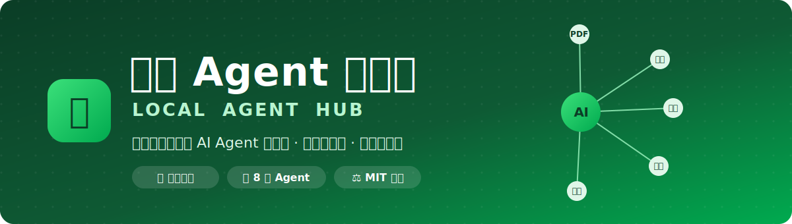
</p>

<p align="center">
  <a href="LICENSE"></a>
  
  
  
  
  
  
</p>

<p align="center">
  <b>一个运行在本机的桌面工具。</b>它通过飞书官方 CLI 读取你有权限访问的飞书文档、知识库、多维表格、会议纪要、云盘文件（Excel / Word / PDF / HTML），在本地建立索引，<br>再用内置的 AI Agent 生成企业内部 HTML 页面、提炼会议纪要、分析多维表格、治理知识库……<br><b>所有数据留在本机，所有写回飞书的动作都需你显式确认。</b>
</p>

<p align="center">
  <a href="#-快速开始">快速开始</a> ·
  <a href="#-八个内置-agent">能力</a> ·
  <a href="#-六大任务场景">场景</a> ·
  <a href="#-工作原理">工作原理</a> ·
  <a href="docs/架构与工作原理.md">架构文档</a>
</p>

---

## ✨ 为什么用它

- 🔒 **本地优先，隐私可控** — 只监听 `127.0.0.1`，不部署服务器、不上云。索引 / 草稿 / 日志全存本机。
- 🙋 **用你自己的身份** — 以你本人的飞书账号授权，只能读你原本就能看到的内容，权限一致、最小化。
- ✅ **写回必确认** — 生成的只是本地草稿；发消息、发邮件、写回飞书都要你手动点确认，工具绝不自动外发。
- 🧩 **开箱即用的 8 个 Agent** — 覆盖内容生产、知识治理、会议沉淀、表格分析、PDF 识别、协作分发。
- 🎛️ **零配置也能跑** — 没配飞书 CLI / 模型 Key 时自动进入 Mock 模式，UI 全流程可演示。
- 📦 **一键分发** — 打包成内置 Node + lark-cli 的单安装包，企业内网离线可用。

<div align="center">

| 🧩 **8** | 🎯 **6** | 🤖 **5** | 🔒 **100%** |
|:---:|:---:|:---:|:---:|
| 内置 Agent | 任务场景 | 模型档位 | 数据存本地 |

</div>

---

## 🖥️ 界面一览

<p align="center">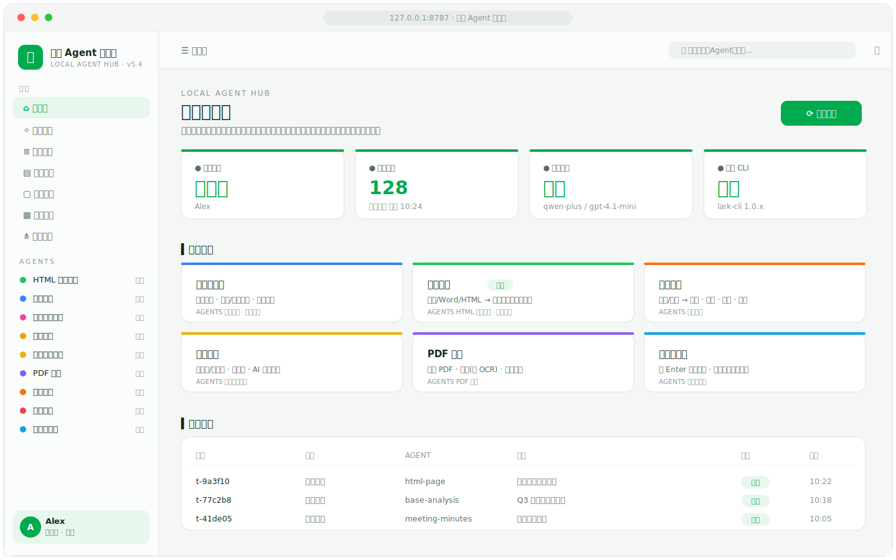</p>

<p align="center"><sub>工作台概览 —— 授权状态、索引进度、任务场景一览。<b>图中均为示例数据</b></sub></p>

<p align="center">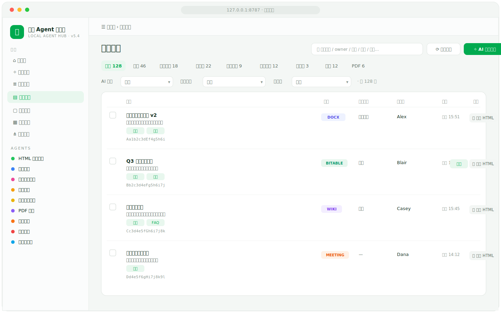</p>

<p align="center"><sub>飞书文档资产库 —— 刷新索引后，按类型/空间/负责人浏览你可访问的资产，一键「生成 HTML / 分析」。<b>示例数据</b></sub></p>

<p align="center">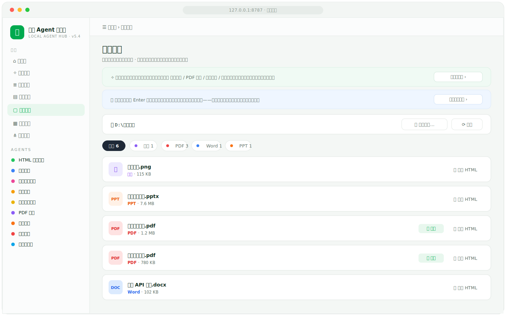</p>

<p align="center"><sub>本地目录 —— 浏览本机文件（截图 / PDF / Word / PPT），可直接「识别 / 生成 HTML」纳入生产。<b>示例数据</b></sub></p>

<p align="center">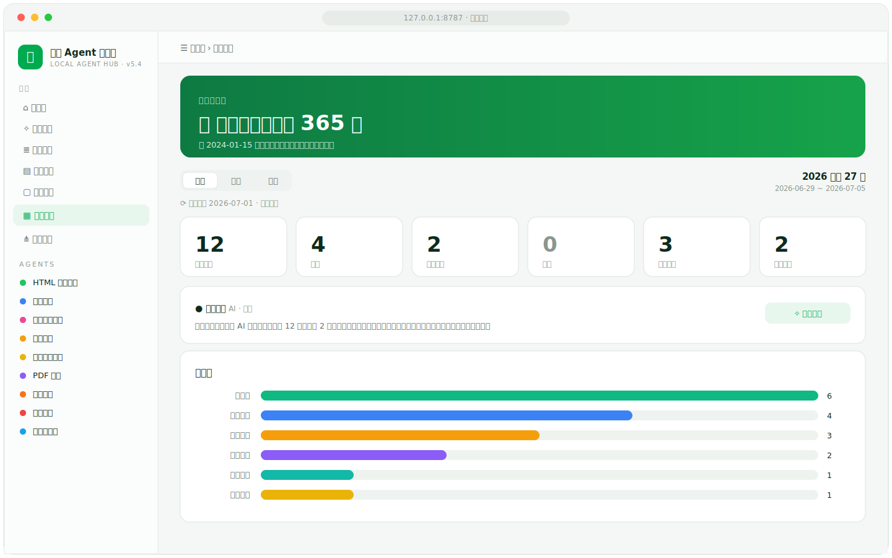</p>

<p align="center"><sub>历史总结 —— 按周 / 月 / 年回顾动过的文档，AI 一键生成工作回顾，并按主题统计。<b>示例数据</b></sub></p>

<p align="center">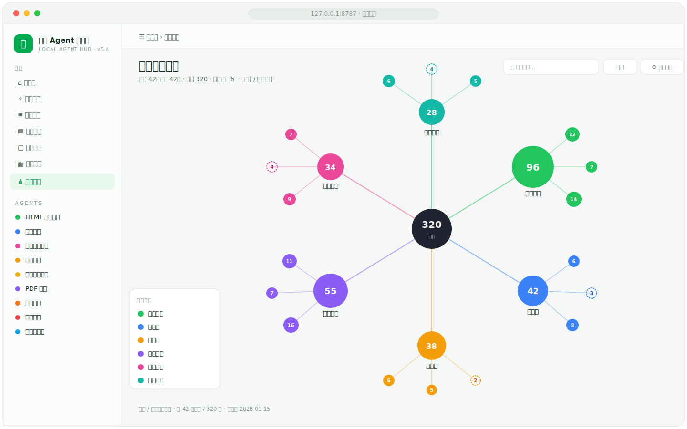</p>

<p align="center"><sub>组织架构图谱 —— 基于通讯录的部门 / 人员关系可视化。<b>图为虚构部门与人数</b></sub></p>

---

## 🧩 八个内置 Agent

<p align="center">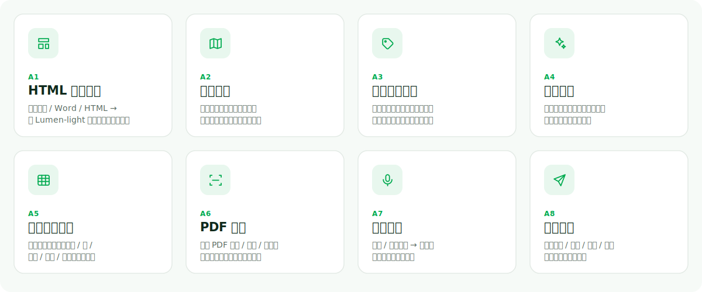</p>

| # | Agent | 做什么 | 输入 → 产出 |
|:--:|---|---|---|
| **A1** | **HTML 页面生成** | 把飞书文档 / 云盘 Word / HTML 套入内置 **Lumen-light** 设计系统，生成企业内部页面。支持「套模板」与「AI 自由版式」。 | 1–3 篇资产 → 可预览 / 下载 / 写回的单文件 HTML |
| **A2** | **文档地图** | 列出你可访问的文档与表格，按类型、归属、重复情况归类。 | 授权范围 → 本地资产索引与目录地图 |
| **A3** | **摘要标签回填** | 为文档批量生成摘要与标签，写入本地索引，也可写回飞书。 | 一批文档 → 摘要 + 标签 |
| **A4** | **知识治理** | 找出重复、过期、缺负责人的文档，并给出处理建议。 | 资产索引 → 治理清单与建议 |
| **A5** | **多维表格分析** | 表格数据归纳并出图（柱状 / 饼 / 折线 / 甘特 / 架构图，可下载）；一次分析全部子表，支持「问数据」自然语言查询。 | 多维表 / 电子表 / Excel → 图表 + 洞察 |
| **A6** | **PDF 识别** | 识别云盘 PDF 全文、字段与表格，扫描页走 OCR，支持逐页识别与合同金额测算。 | 云盘 PDF → 结构化文本 / 字段 / 金额 |
| **A7** | **会议纪要** | 把妙记或会议记录整理成摘要、决策、待办和风险点，待办可写回飞书任务。 | 会议 / 妙记 → 结构化纪要 |
| **A8** | **协作分发** | 生成消息、邮件、任务和日程提醒的草稿，确认后再发送。 | 成果 → 消息 / 邮件 / 任务草稿 |

> 另有 **📸 自动化提炼** 特性（见下），以及 index-enrich / local-image 等支撑能力。

---

## 🎯 六大任务场景

任务场景是把几个 Agent 组合起来的预设流程：

| 场景 | 说明 | 用到的 Agent |
|---|---|---|
| **知识库治理** | 盘点文档、分类，过滤重复和缺负责人的内容 | 文档地图 · 知识治理 |
| **内容生产** 🌟 | 从飞书文档或云盘 Word / HTML 生成 HTML 页面、摘要与 FAQ | HTML 页面生成 · 文档地图 |
| **会议沉淀** | 把会议记录整理成摘要、决策、待办和风险 | 会议纪要 |
| **表格分析** | 归纳表格数据并出图；支持全部子表与云盘 Excel | 多维表格分析 |
| **PDF 识别** | 云盘 PDF 的全文、字段、表格识别 | PDF 识别 |
| **协作分发** | 起草消息、邮件、任务和日程提醒 | 协作分发 |

**「内容生产」这条流水线长这样：**

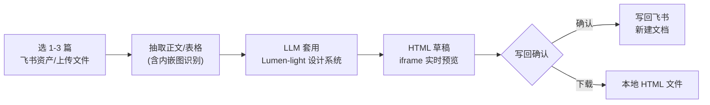

<p align="center">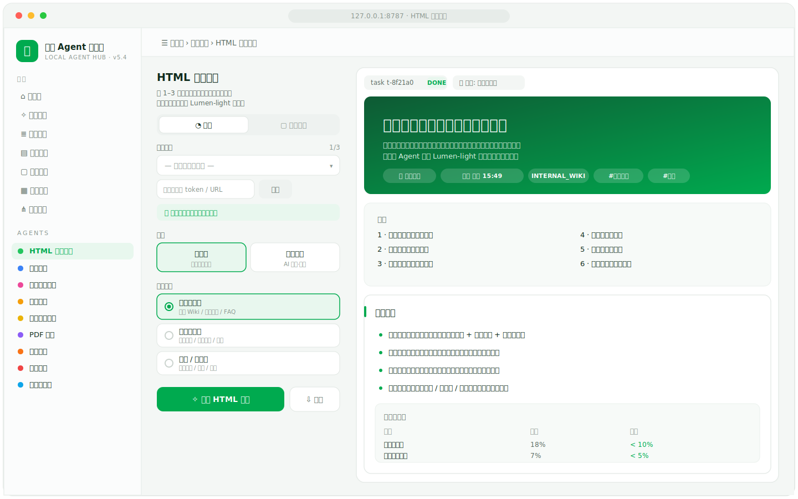</p>

<p align="center"><sub>「内容生产」：左侧选资产与模板，右侧实时预览 Agent 生成的页面。<b>示例数据</b></sub></p>

---

## 📁 支持的文件类型

工作台区分两类对象 —— **🟢 飞书在线对象**（有内容接口，直接读）与 **🔵 云盘上传文件**（二进制，先下载到本机，再用对应解析器抽取）：

| 类型 | 场景 | 工作方式 |
|---|---|---|
| 🟢 **飞书文档** `docx·doc·wiki` | 内容生产 / 知识治理 | 抽取正文（含内嵌图识别）→ 重组 HTML，或生成摘要 / 标签 |
| 🟢 **多维表格** `bitable` | 表格分析 | 读全部子表 → 列画像 → AI 出图，数字由本地精确聚合 |
| 🟢 **电子表格** `sheet` | 表格分析 | 逐工作表出图，支持「问数据」自然语言查询 |
| 🟢 **演示文稿** `slides` | 内容生产 | 抽取页面文字 → 重组 HTML |
| 🟢 **会议 / 妙记** `meeting` | 会议沉淀 | 整理成摘要、决策、待办、风险 |
| 🔵 **PDF** `.pdf` | PDF 识别 | 逐页抽取正文与表格，扫描件走 OCR → 字段 / 金额测算 |
| 🔵 **Excel** `.xlsx .xls` | 表格分析 | 本地解析每个工作表 → 出图与「问数据」 |
| 🔵 **Word** `.docx` | 内容生产 | 本地解析段落与表格 → 重组 HTML |
| 🔵 **网页** `.html .htm` | 内容生产 | 提取正文 → 重组 HTML |

> 🟢 在线对象 · 🔵 云盘上传。解析全部在本地完成（Excel → openpyxl，Word → python-docx，网页 → BeautifulSoup，PDF → PyMuPDF），不外传。

---

## 📸 自动化提炼

工作期间在任意窗口按 **Enter** 自动留痕当前窗口截图（存本机私有目录，与「内容生成」隔离），每隔一段时间用视觉模型提炼「这段时间在做什么」——重点、操作、会议、待办。**单次会话最长 10 小时自动停止**（停止前做最后一次提炼，避免尾段丢失）。

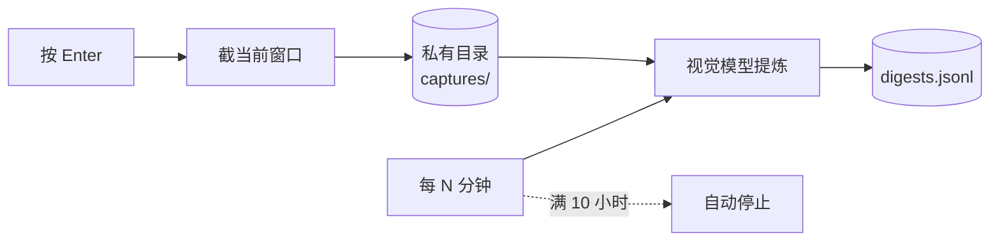

<p align="center">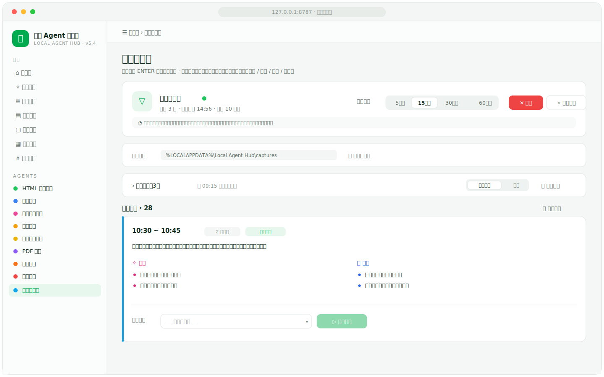</p>

<p align="center"><sub>自动化提炼 —— 提炼频率、开始时刻、10 小时自动停止，以及按窗口提炼出的「重点 / 操作」。<b>示例数据</b></sub></p>

---

## 🏗️ 工作原理

前端是浏览器里的单页应用，后端是只监听 `127.0.0.1` 的 FastAPI 进程。除了「调飞书 OpenAPI」和「调你配置的模型服务」，其余数据都留在本机。

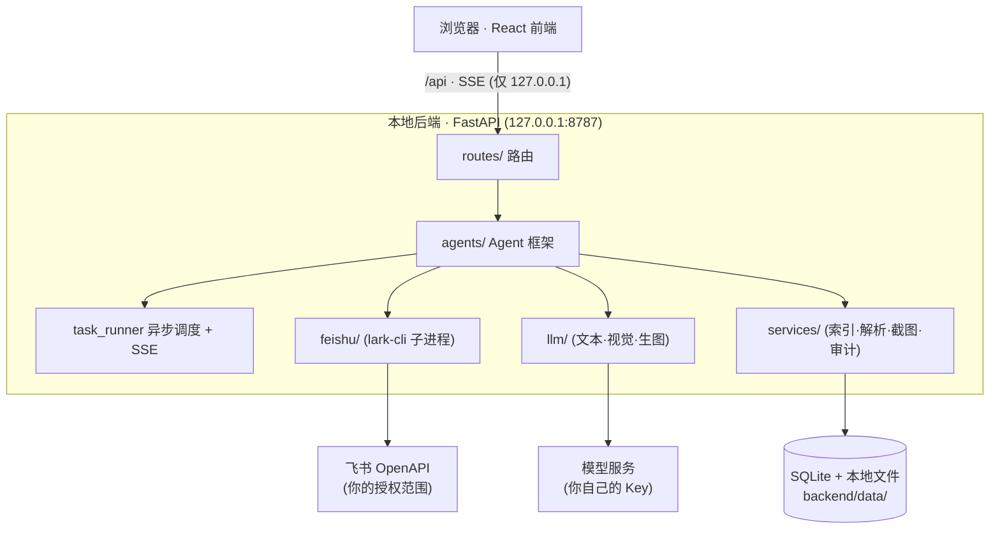

一次任务：**刷新索引** → **选资产起任务** → **SSE 实时看日志** → **产出草稿预览** → **写回确认（记审计）**。生产打包后，后端用 `StaticFiles` 同源托管前端，单进程即可运行。

📖 更深入的组件、时序图与扩展点见 **[docs/架构与工作原理.md](docs/架构与工作原理.md)**。

---

## 🚀 快速开始

**前置依赖**：Node.js ≥ 18 · Python 3.11 · 一个飞书账号（可选：文本 / 视觉模型 API Key）

### Windows · 双击运行

双击根目录的 **`启动本地Agent.bat`**，无需终端。脚本会自动检测环境、首次安装飞书 CLI、创建 venv、装依赖、起前后端并打开浏览器，首页顶部的「立即授权飞书」引导你完成授权。

### macOS / Linux

```bash
chmod +x scripts/start.sh
scripts/start.sh
```

上手四步：**① 安装启动 → ② 授权飞书 → ③ 刷新索引 → ④ 运行 Agent / 查看产出**


---

## ⚙️ 配置

### 飞书 CLI 授权

```bat
scripts\install-lark-cli.cmd
:: 或手动：
npx @larksuite/cli@latest install
lark-cli auth login --recommend
```

授权一次即可，凭据存系统钥匙串，UI 永不显示凭据。若要用你自己的专用飞书应用，在 `backend/.env` 填 `FEISHU_APP_ID` / `FEISHU_APP_SECRET`。

### 模型（`backend/.env`）

```env
# 文本模型 · OpenAI 兼容端点（如阿里百炼 / DashScope）
TEXT_MODEL_PROVIDER=openai_compatible
TEXT_MODEL=qwen-plus
TEXT_MODEL_BASE_URL=https://dashscope.aliyuncs.com/compatible-mode/v1
TEXT_MODEL_API_KEY=sk-your-key

# 视觉模型 · Azure OpenAI
VISION_MODEL_PROVIDER=azure
VISION_MODEL=your-deployment-name          # Azure 的「部署名」，不是模型名
VISION_MODEL_AZURE_ENDPOINT=https://YOUR-RESOURCE.openai.azure.com/
VISION_MODEL_API_KEY=your-azure-key
```

完整字段见 [`backend/.env.example`](backend/.env.example)。**任何 Key 留空 → 对应模型自动进入 Mock，UI 仍可演示；文本与视觉互相独立。**

### 🤖 模型分工（按任务分档，平衡速度 / 成本 / 质量）

| 档位 | 模型（示例） | 用途 |
|---|---|---|
| **默认** | `qwen-plus` | 会议纪要、表格分析、通用解读 |
| **快速** | `qwen-flash` | 批量索引回填、治理复核 |
| **高质量** | `qwen-max` | HTML 重组、合同金额测算 |
| **视觉** | `gpt-4.1-mini` | PDF 逐页识别、扫描件 OCR、内嵌图说明 |
| **生图** | `gpt-image-1` | 表格分析里的架构图 / 关系图 / 概念图 |

---

## 🔀 完整模式 vs Mock 模式

| 依赖 | 完整模式 | Mock 回退 |
|---|---|---|
| `lark-cli`（@larksuite/cli） | 必需，需 `auth login` | 返回示例资产数据 |
| LLM API Key | 必需 | 返回模板 JSON / 占位图 |
| SQLite | 自动创建 | 同 |

Mock 模式下 UI 可完整跑通全流程（含 HTML 生成 + 写回确认 → 模拟返回值），适合离线演示与二次开发。

---

## 🔒 安全与隐私

- **仅监听 `127.0.0.1`**，不暴露公网、不部署服务器。
- 飞书凭据由 `lark-cli` 存于**系统钥匙串**；模型 Key 存本地 `.env`（已 gitignore）。
- **界面永不显示任何 API Key / 密钥。**
- **所有写回飞书的动作必须显式确认**，并记入本地审计日志。
- 本地只存元数据与草稿，不默认持久化完整文档正文。
- ⚠️ 模型调用会把必要上下文发到你配置的模型服务——这是唯一离开本机的业务数据，请按团队合规评估。
- 仓库不含任何真实凭据，请填入你自己的飞书应用与模型 Key。

---

## 📦 打包发版

Windows 一键打包为单安装包（PyInstaller 后端 + `npm run build` 前端 + Inno Setup）：

```bat
scripts\bump_version.ps1 X.Y      :: 同步 4 处版本号
build\build_installer.cmd         :: 产出 dist-installer\LocalAgentHub-Setup-X.Y.exe
```

> 需 [Inno Setup 6](https://jrsoftware.org/isdl.php) 与内置 Node 运行时（放在 `build/tools/`，不入库）。生产密钥放 `build/production.env`（已 gitignore）。

---

## 🗂️ 目录结构

```
backend/    Python 3.11 + FastAPI 本地服务
  app/
    routes/    HTTP / SSE 路由
    agents/    各 AI Agent（import 即注册）
    services/  索引 · 解析 · 截图 · 审计
    feishu/    飞书适配：lark-cli 子进程 + mock
    llm/       文本 / 视觉 / 生图客户端与 prompts
    html/      Lumen-light 设计系统 + 渲染器 + 模板
frontend/   Vite + React + TypeScript（src/pages/ 各页面）
config/     团队共享配置（agents / 模板 / 分类规则）
scripts/    启动与安装脚本（Windows / macOS / Linux）
build/      打包（PyInstaller + Inno Setup）
docs/       架构与工作原理文档
```

**开发**：后端 `pip install -e . && python -m uvicorn app.main:app --reload`（`127.0.0.1:8787`），前端 `npm install && npm run dev`（`127.0.0.1:5173`，已代理 `/api`）。OpenAPI 文档：`127.0.0.1:8787/docs`。

---

## 📄 许可

[MIT License](LICENSE) · 内置 **Lumen-light** 轻量绿色设计系统。欢迎 issue / PR。
