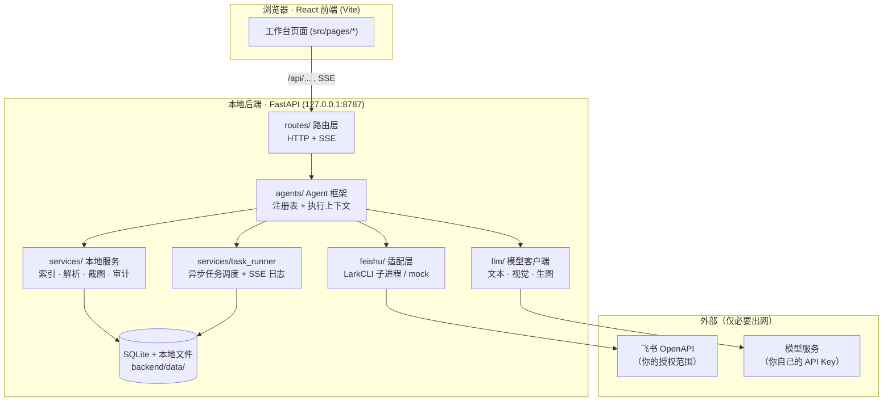
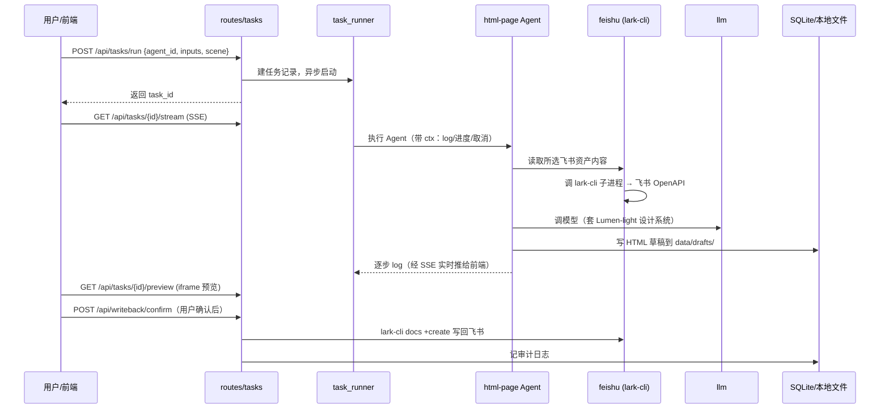
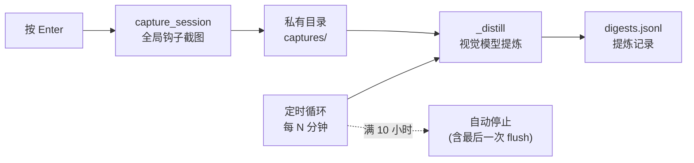

# 架构与工作原理

本文说明「本地 Agent 工作台」的整体架构、核心数据流，以及如何扩展。目标是让你读完就能理解系统怎么跑起来、一次任务经过了哪些环节、以及从哪里下手改造。

---

## 1. 全景

系统是一个**本地优先**的应用：前端是浏览器里的单页应用，后端是只监听 `127.0.0.1` 的 FastAPI 进程。除了「调用飞书 OpenAPI」和「调用你配置的模型服务」这两处必要的出网，其余数据都留在本机。

**技术栈**

| 层 | 技术 |
|---|---|
| 前端 | Vite + React + TypeScript |
| 后端 | Python 3.11 + FastAPI + Uvicorn |
| 存储 | SQLite（元数据/任务/审计）+ 本地文件（草稿/截图/日志） |
| 飞书访问 | 官方 `@larksuite/cli`（子进程调用） |
| 模型 | OpenAI 兼容端点 / Azure OpenAI（文本、视觉、生图） |
| 打包 | PyInstaller（后端）+ Vite build（前端）+ Inno Setup（安装包） |

生产打包后，后端用 `StaticFiles` **同源托管**前端构建产物：`index.html` 以 no-cache 提供、带哈希的静态资源可缓存。因此正式运行时只有一个后端进程，无需单独跑前端。

---

## 2. 一次任务的生命周期

以「HTML 页面生成」为例（其它 Agent 结构一致）：

要点：

- **异步 + 流式**：任务在后台协程里跑，前端用 SSE 实时看日志，不阻塞。
- **写回需确认**：Agent 只产出草稿；真正写回飞书是独立的、需用户点确认的动作，并落审计。
- **可取消 / 可恢复**：后端重启时会「回收」上次遗留的 running 任务（见 `main.py` 的 `reap_orphans`）。

---

## 3. Agent 框架

所有 Agent 放在 `backend/app/agents/`，通过**导入即注册**的方式挂到注册表：`main.py` 里 `from . import agents` 触发各模块的 `register_agent(...)` 副作用。

- `agents/base.py`：定义 Agent 基类 / 执行上下文（`ctx.log(...)`、进度、取消、访问 `feishu` / `llm` / `services`）。
- 每个 Agent 一个文件，例如 `html_page.py`、`meeting_minutes.py`、`base_analysis.py`、`document_map.py`、`knowledge_governance.py`、`collab_dispatch.py`，以及支撑型的 `index_enrich.py`、`local_image.py`、`pdf_recognition.py`。
- `config/agents.yaml`：团队共享的 Agent 开关与默认参数（改后重启后端生效）。

### 如何新增一个 Agent

1. 在 `backend/app/agents/` 新建 `your_agent.py`，继承基类并实现 `run(ctx, inputs)`。
2. 在模块内调用 `register_agent(id="your-agent", ...)`。
3. 确保它被 `agents/__init__.py` 或 `main.py` 的包导入路径覆盖（import 即注册）。
4. 如需团队级开关/参数，在 `config/agents.yaml` 增加对应条目。
5. 前端在对应页面（`src/pages/`）接上 `/api/tasks/run` 即可。

---

## 4. 飞书适配层（feishu/）

- `feishu/cli.py` — `LarkCLI`：把对飞书的每一次访问封装成对 `@larksuite/cli` 的**子进程调用**（如 `docs +list`、`wiki spaces list`、`minutes list`、`docs +create`）。授权由 `lark-cli auth login` 完成，凭据存系统钥匙串，后端不碰明文 token。
- `feishu/mock.py` — 无 CLI 或未授权时的**假数据回退**，返回示例资产，保证 UI 全流程可跑。
- `get_lark()`：根据 CLI 可用性 + `ENABLE_MOCK_FALLBACK` 决定返回真实 `LarkCLI` 还是 mock。
- 启动时若检测到内置专用应用（`FEISHU_APP_ID/SECRET` 非空），会 `ensure_app_configured()` 把 lark-cli 切到该应用。

---

## 5. 模型层（llm/）

- `llm/client.py`：统一封装**文本 / 视觉 / 生图**三类模型，每类支持 `openai_compatible` 与 `azure` 两种 provider。
- 文本模型有三档：`text_model`（均衡）、`text_model_fast`（省钱快速）、`text_model_best`（高价值高风险单次任务，如 HTML 直出）。
- 任一模型的 Key/端点为空或占位 → 该模型进入 **mock**（返回模板 JSON / 占位图），不报错、UI 可演示。文本与视觉的 mock 状态互相独立。
- `llm/prompts.py`：各场景 prompt，其中 HTML 自由版式会把 `html/design_system.py` 的 **Lumen-light** 设计规范喂给模型。

---

## 6. HTML 生成与 Lumen-light 设计系统（html/）

- `html/design_system.py`：内置 **Lumen-light** 轻量绿色企业设计系统（`:root` CSS token + 组件规范），供「AI 自由版式」喂给模型，保证产出观感统一。
- `html/templates/`：Jinja 模板。`lumen_base.html` 是基础模板，`internal_wiki.html` / `project_show.html` / `announcement.html` 通过 `` 继承它。
- `html/renderer.py`：把 Agent 产出的结构化 JSON 套入模板，渲染成单文件 HTML（CSS 内联，可独立打开）。

两种版式：**套模板**（稳定一致）与 **AI 自由版式**（更丰富但较慢、偶有版式波动，数字会做核验）。

---

## 7. 自动化提炼（services/auto_extract.py）

一个独立的后台能力：工作期间在任意窗口按 Enter 自动截当前窗口，存到本机私有目录，隔一段时间用视觉模型提炼「这段时间在做什么」。

- `capture_session.py`：全局 Enter 钩子 + 截图；本应用窗口自动跳过。
- `auto_extract.py`：定时循环调用 `_distill(_cursor_ts, now)` 对「上次提炼以来」的截图做一次提炼；**单次会话最长 10 小时自动停止**，停止前做最后一次 flush 避免尾段丢失。
- 截图存应用私有目录，**与「内容生成」隔离**，不出现在任何文件选择器里；提炼结果存 `digests.jsonl`，不进运行记录。

---

## 8. 存储与数据落地

`backend/data/`（已 gitignore，不进仓库）：

| 路径 | 内容 |
|---|---|
| `index.sqlite` | 资产元数据、任务、写回队列、审计日志 |
| `drafts/{task_id}.html` | Agent 产出的 HTML 草稿 |
| `captures/` | 自动化提炼的私有截图 + `digests.jsonl` |
| `*.log` | 应用与 lark-cli 日志 |

只存元数据与草稿，不默认持久化完整文档正文。

---

## 9. 配置与版本

- 运行配置读自 `backend/.env`（见 `config.py` 与 `.env.example`）。
- 版本号有 4 处（前端徽章 / package.json / 安装包 / 后端 `/api/health`），用 `scripts/bump_version.ps1 X.Y` 一键同步。
- 健康检查：`GET /api/health` 返回 `{"ok": true, "version": "X.Y"}`。

---

## 10. 安全边界

- 后端仅监听 `127.0.0.1`，CORS 只允许本地前端来源。
- 飞书凭据在系统钥匙串（由 lark-cli 管理）；模型 Key 在本地 `.env`。
- 界面不显示任何密钥；所有写回飞书的动作需显式确认并记审计。
- 模型调用会把必要上下文发到你配置的模型服务——这是唯一会离开本机的业务数据，请按团队合规要求评估。
